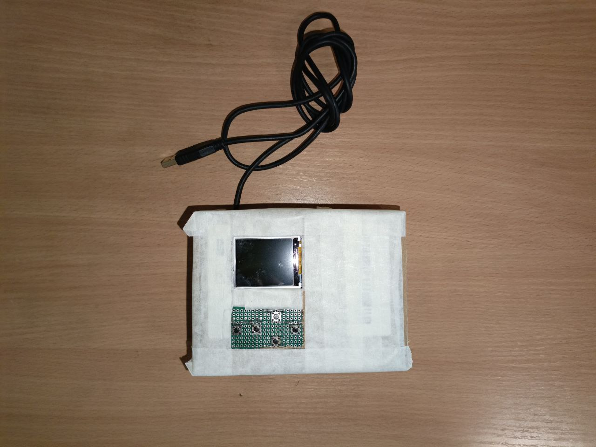

**Калькулятор номинала резистора графический интерактивный**

---

## 1. Задача

Устройство предназначено для визуального и интерактивного определения номиналов резисторов на основе стандартной цветовой маркировки. Оно должно обеспечивать считывание значений сопротивления с учётом допуска и поддерживать цветовую кодировку резисторов с 4 и 5 кольцами.

---

## 2. Решение

Поскольку задача требовала графического отображения резистора и его номинала, был выбран цветной экран — TFT-дисплей ST7735 1.44". Для надёжного отображения и достаточной производительности необходим микроконтроллер с достаточным объёмом памяти, поэтому в качестве центрального элемента использован ESP32 на отладочной плате ESP32-WROOM.

Дисплей подключается к микроконтроллеру по протоколу SPI. В качестве устройства ввода использованы кнопки, подключённые по технологии pull-up.

После выбора компонентов была разработана схема подключения периферии к микроконтроллеру:

Программное обеспечение использует библиотеку Adafruit для вывода графики на экран.

Корпус устройства изготовлен из практичного, экологически разлагаемого материала — уплотнённой бумаги. Так как калькулятор не предполагается как мобильное устройство, питание осуществляется от блока питания, подключаемого к встроенному шнуру.

После сборки проекта был получен следующий прототип:

Ниже представлен видеоряд работы устройства:

[demo.mp4](demo.mp4)

---

## 3. Разработчик

Буторин Даниил

